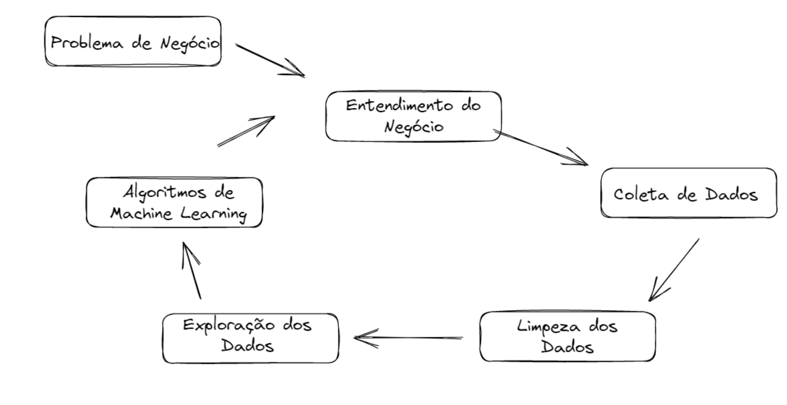
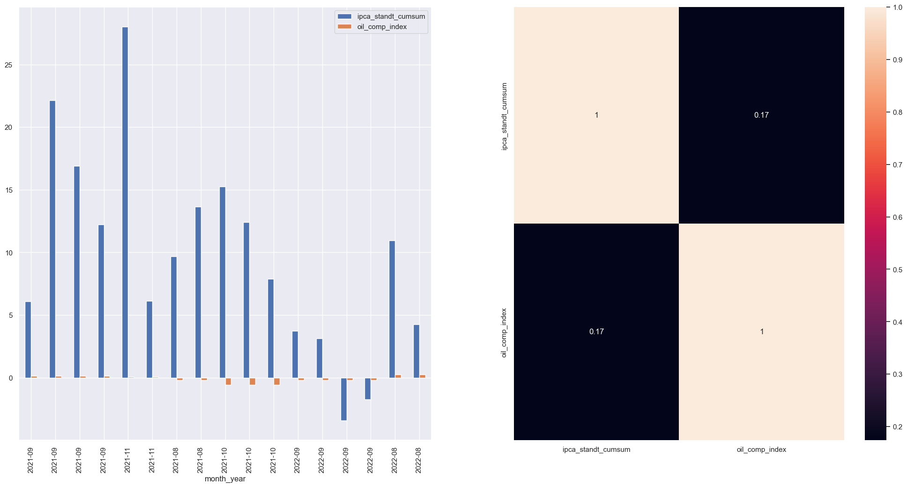
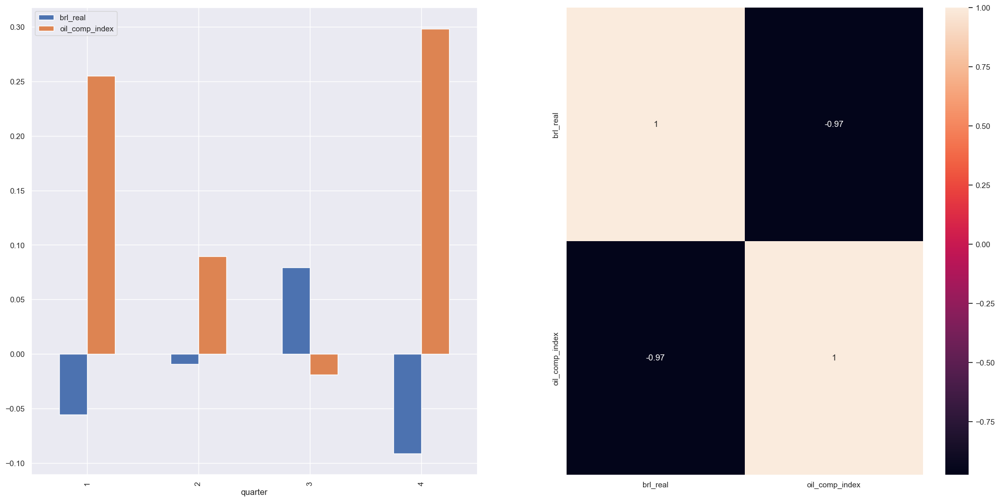
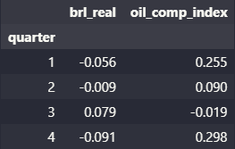
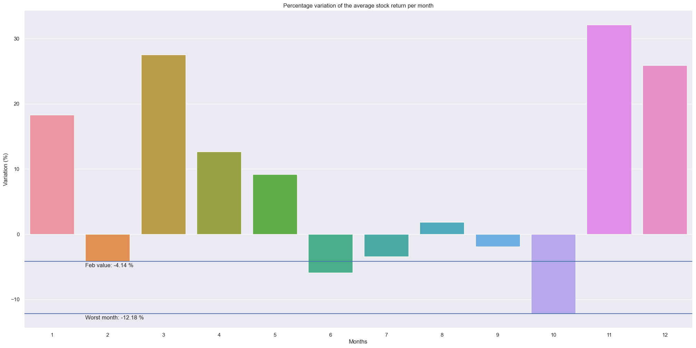
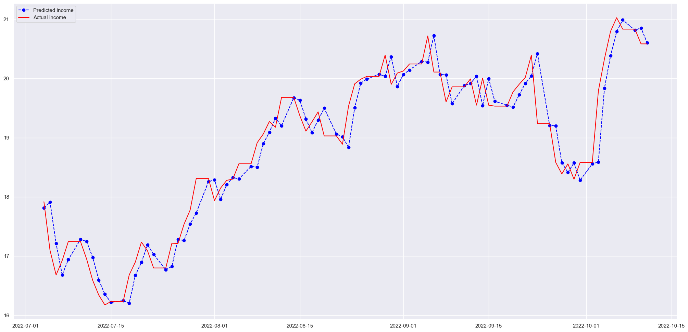

# Strategy for buying and selling stocks

# 1. Business Problem.

A empresa Holding Assets oferece serviços de acessoria financeiras para pessoas físicas e jurídicas, uma de suas principais carteiras consiste de alocações em renda variável com diversificação em setores disponíveis na Bovespa.

A empresa percebeu que ao longo do tempo algumas alocações em determinados setores não estão trazendo os retornos esperados e busca alternativas para que novas alocações sejam feitas em prol de melhorar o rendimento. Existem diversas estratégias e indicadores para analisar determinadas empresas e setores, portanto a Holding Assets decide focar primariamente em melhorar sua rentabilidade no setor de Petróleo e Gás, considerada aquelas com menor desempenho em sua carteira.

O time de analistas realizou estudos sobre algumas das principais empresas do setor e as indicou para compor a carteira, existem diversas estratégias para compra e venda de ativos e a equipe não possui pessoas suficiente para explorar todas as opções e decidir a melhor.

Portanto desenvolvi um projeto de análise das ações, volatividade e indicadores financeiros para entender os padrões e realizei testes com dados históricos para simular diversas estratégias em busca de indicar a melhor a ser adotada pela empresa.

# 2. Business Assumptions.

Foram assumidas as seguintes premissas:

- Serão adotados as ações das empresas: RRRP3, CSAN3, DMMO3, ENAT3, PRIO3, PETR3, RECV3, RPMG3, UGPA3, VBBR3.
- A janela de tempo corresponde a 11/01/2020 até 10/10/2022, sendo o período mínimo adotado para o backtesting de 1 ano.
- Não haverá taxa de operação na compra e venda de ações.
- O orçamento para simular as operações corresponde a no máximo R$ 100.000,00.

# 3. Solution Strategy

Para resolver o problema de negócio utilizo da metodologia CRISP-DM adaptada para os processos de ciência de dados, as etapas de processos para a solução serão as seguintes:

Utilizei os seguintes princípios da metodologia:

**Step 01. Data Description:** Coleto dados públicos das ações, indices e indicadores do período, realizo algumas limpezas e faço uma breve análise estatística. Tenho como objetivo entender a dificuldade do projeto em nível de quantidade e qualidade dos dados, também em identificar problemas gritantes como falta de dados ou valores incorretos.

**Step 02. Feature Engineering:** Desenvolvo hipóteses iniciais sobre o negócio para poder derivar novos atributos com base nas variáveis originais afim de descrever melhor o fenômeno a ser compreendido, os novos dados me auxiliam na validação de hipóteses e na construção dos testes de estratégias de compra e venda.

**Step 03. Exploratory Data Analysis:** A partir das hipóteses geradas exploro os dados para encontrar insights e entender melhor o impacto das variáveis, também busco compreender o comportamento de cada variável e suas correlações com as demais.

**Step 04. Portfolio Strategy:** Desenvolvo algumas estratégias conhecidas do mercado com o auxílio de features criadas e realizo os testes em uma janela de tempo através da técnica de backtesting para um período de aproximadamente 2 anos.

**Step 05. Machine Learning Modelling:** Desenvolvo um algoritmo que capta as tendências das oscilações para realizar predições das ações, crio uma estratégia de compra e venda com baso nos valores preditos e comparo os resultados com as estratégias desenvolvidas anteriormente.

**Step 06. Convert Performance to Business Values:** Atribuo métricas de performance e gráficos que auxiliam na comparação das estratégias apresentadas com o objetivo de auxiliar na tomada de decisão da melhor abordagem

# 4. Top 3 Data Insights

**Hypothesis 01:** Em média as ações de empresas de petróleo e gás crescem 5% a mais do que a inflação.

- (Figura 1) Mesmo quando normalizado, é difícil ver o impacto da inflação nos ativos, mas é suficientemente significativo para dizer que a inflação tem um maior impacto.
- (Figura 2) O baixo valor de correlação indica que as variáveis são praticamente não correlacionadas.

**FALSE** A inflação cresce significativamente mais do que o preço das ações

**Hypothesis 02:** Em períodos trimestrais onde o Real desvaloriza em media 5% as ações valorizam em média 10%.

- Temos duas situações em que é possível validar a hipótese: 
1. No 1º trimestre, para uma queda de 6% no real, a ação valoriza 25%.
2. No 4º trimestre, para uma queda de 9% no real, a ação valoriza 29%.

**TRUE** Em média para 7% de desvalorização do real as ações valorizam em média 27%.

**Hypothesis 03:** Ações nos meses de fevereiro rendem em média 5% menos em relação aos demais meses.

**FALSE** O pior mês é Outubro com uma diferença média de 8,07 % entre fevereiro.

# 5. Backtesting Strategy

Realizando o backtesting de algumas estrategias no período total dos dados coletados (11/01/2020 até 10/10/2022) temos os seguintes resultados:

|Stat     |            Mean stock Hold  |  Mean stock Reb  |  Mean bbands  |  Mean stock ma cross| 
|------------------- | ----------------- | ---------------- | ------------- | --------------------|
|Total Return       |  19.90%            | 11.46%           | 11.57%        | -23.74% |
|Monthly Skew        | -0.88             | -0.88            | -0.24         | -0.63 |
|Monthly Mean (ann.) | 15.62%            | 7.81%            | 7.41%         | -15.63% |
|Avg. Drawdown       | -8.74%            | -4.51%           | -3.20%        | -29.06% |
|Monthly Sortino    |  0.80              | 0.80             | 1.68          | -0.80 |

1. Em resumo, a estratégia de Hold tem o melhor desempenho, a sua vantagem também inclui menos dedicação na análise, acompanhamento e manutenção do investimento.
2. A segunda é a estratégia das bandas de bollinger, que tem retornos semelhantes ao rebalanceamento, mas com menor exposição ao risco.

É também possível que o próprio rebalanceamento tenha retornos mais elevados devido a sua natureza de sempre manter dinheiro líquido para equilibrar as carteiras, esse dinheiro pode ser aplicado em rendimentos fixos e de baixo tempo de resgate, mas na prática toda carteira será bem diversificada, o correto seria simular uma carteira distribuida em diversos segmentos para uma comparação justa ao rebalanceamento.

# 6. Machine Learning Model Applied
 
Para esse projeto foi aplicado o algoritmo ARIMA, um modelo recomendado para análises temporais onde busca captar tendências e remover ruídos.

| Model Name | ARIMA |
| ---------- | ----- |
| MAE | 0.260 |
| MAPE | 0.014 |
| RMSE | 0.350 |

De acordo com a métrica MAPE o modelo tem um erro nas previsões de 1,4%, essencialmente um erro muito baixo e deve ser suspeito, contudo a lógica de treino ajuda-o a ter boas previsões.

- Recebe dados do dia 1 -> prevê o dia 2
- Recebe dados do dia 2 -> prevê o dia 3

Utilizando o exemplo vamos supor que o modelo diz que o dia 2 corresponde a um aumento de 2% da ação, mas na prática o dia 2 tem uma diminuição de 1%, quando o modelo prevê que o dia 3 receberá os dados que o dia 2 teve uma diminuição e com isso ajustará a sua previsão apontando para uma possível nova diminuição.

A métrica MAE aponta para um erro médio de 0,258 no valor da acção, as próprias acções utilizadas para esta formação têm um intervalo de 16,17 a 21,02.

A métrica do RMSE é mais utilizada para analisar o desempenho do modelo, tende a mostrar o impacto de outliers.

No geral, as três métricas são muito boas, o modelo acompanha muito bem a tendência real do mercado conforme o gráfico abaixo.

O maior problema do teste no algoritmo ocorre por utilizar aproximadamente 3 meses de backtesting, enquanto estabeleci a premissa que um bom backtesting deverá ocorrer em pelo menos 1 ano, para o modelo aumentar o tempo de backtesting significa diminuir o seu tempo de treino, portanto o melhor a ser feito é coletar mais dados das ações e realizar um novo ciclo.

# 7. Business Results

Vamos recuperar os dados das estratégias: 

|Stat     |            Mean stock Hold  |  Mean stock Reb  |  Mean bbands  |  Mean stock ma cross| 
|------------------- | ----------------- | ---------------- | ------------- | --------------------|
|Total Return       |  19.90%            | 11.46%           | 11.57%        | -23.74% |

Assumindo a premissa de um orçamento inicial para os testes na Holding assets de R$ 100.000,00 seria distribuido os recursos para a estratégia de Hold, considerando períodos anuais essa estratégia se sobressai, quando observamos janelas curtas de tempo é possível que outras tenham desempenho superior devido a melhor controle sobre períodos de queda.

Com os R$ 100.000,00 aplicados o retorno na janela de 1 ano e 10 meses é um ganho bruto de R$ 19.900,00 o que somado ao patrimônio inicial corresponde a R$ 119.900,00.

Apenas para ilustrar com a estratégia do algoritmo ARIMA o retorno em 3 meses corresponde a 224.99% gerando um patrimônio final de R$ 224.990,00.

# 8. Lessons Learned

- O mercado financeiro possui um mar de possibilidades, pessoalmente tive bastante contato na área, observar os processos internos trouxe horizontes de possibilidades e isso ocorreu com um escopo limitado como o setor de petróleo e gás, terminar esse ciclo de projeto me deixa animado com alternativas em outros cenários.
- A técnica de Backtesting é bem interessante para praticar no mercado, permite entender melhor algumas possibilidades, definitivamente irei utilizar desse conhecimento para estudar estratégias nas finanças pessoais.
- Existem muitos impactos no mercado e de certo observei apenas uma fração deles, entretanto conforme avançamos maior fica a sua complexidade, o simples é sempre o melhor passo inicial.

# 9. Next Steps to Improve

- **Coletar mais dados:** Em quantidade para fazer comparações com algorítmos na janela mínima de 1 ano. Também em qualidade para identificar os impactos de outros indicadores das empresas e macroeconômicos.
- **Algorítmos:** É possível aplicar outros que trabalham com séries temporais, assim como também machine learning de regressão, árvore de decisão e etc.
- **Estratégias:** Aprender e desenvolver novas estratégias, também existe a possibilidade de combinar 2 ou mais estratégias.
- **Deploy:** Disponibilizar os dados em site para consultas e comparações através de filtros. 